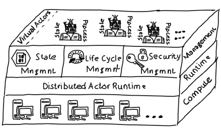
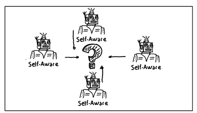

# AI Agent Development

## Concepts

The landscape of patterns, architecture, and best practices for creating AI-infused and AI-powered enterprise-grade applications is evolving rapidly.

One of the emerging concepts is the use of microservice agents, which are designed to perform clearly defined tasks and deliver well-defined results. Those microservice agents can independently collaborate with humans to solve specific tasks or challenges. The goal hereby is to create a collaboration between Humans which might already have re-active support by Copilot like applications and pro-active Agents which can execute in the fore-, and background.

This repository introduces 3 concepts to support the development and operation of Agents or agentic AI enabled workloads:

- Actor Frameworks to host and run Agents in production
- Collaboration Pages to allow interaction between AI supported Agents and Humans
- Self-aware Agents which decide if they add functionality to solve a given task 

### Actor Framework

Using the concepts of Actor Frameworks provides a range of functionalities, including state management, agent life cycle management (virtual actors), asynchronous messaging, security concepts, and easy-to-scale compute runtime, just to name a few.



The sample in this repository utilizes [Microsoft Orleans](https://learn.microsoft.com/en-us/dotnet/orleans/overview) as the Actor framework and runtime, showcasing its capabilities in managing and running agents efficiently.

### Collaboration Pages

The concept of a collaboration page, or in other words, an event-enabled "area" or service, is where humans and AI agents can collaborate and share tasks, results, and various artefacts.


This fosters seamless interaction and cooperation between human users and AI agents. This repo uses a simple Azure Storage Account Container as collaboration environment.

Microsoft [Copilot Wave 2](https://techcommunity.microsoft.com/blog/microsoft365copilotblog/announcing-copilot-pages-for-multiplayer-collaboration/4242701) is leveraging this concept for multiplayer collaboration, enabling users to work together with AI in real-time, share insights, and achieve common goals. Currently Copilot Page functionality is provided by a Loop component.

### Self-aware Agents

The concept of "self-aware" agents complements the approach where a so-called orchestrator agent has an overview of the capabilities and functionalities of other agents and orchestrates them based on a given task description.


However, the concept shown in this repository takes a different approach by eliminating the need for a nominator agent. Instead, all agents collaboratively working on a task decide on their own if they can and want to contribute to solving a specific task. This decentralized decision-making process adds additional flexibility and scalability. It's worth to mention that both concepts can be used in parallel or exclusively, according to the expected Agent behavior.



## Repo Content

### Use Case

In the fictional use case from a simplified contact center scenario, the goal is to detect the language and sentiment of a human caller. To simplify the sample, an already transcribed text file with the caller's content is used.However, just as text input is utilized, multi modal input such as audio or video can also be employed.

To fulfill this task, three agents are provided:

- a Sentiment Detection Agent,
- a Language Detection Agent,
- and a Summarizer Agent,

which combines the findings from the other agents.

### Solutions / Projects 

| Project | Description | Details |
|----------|----------|----------|
| [Agent Runtime](./src/AgentRuntime)  | A c# asp.net application providing an Orleans cluster  | The Orleans cluster is used to initiate, execute and control life time of agents. It also provides state management for the specific agents  |
| [Behavior Contract](./src/BehaviorContract/)  | A c# class library providing interface definitions  | The class library is used to define Agent functionality and Agent state requirements. It's following patterns requested by Orleans to run agents as [Orleans grains](https://learn.microsoft.com/en-us/dotnet/orleans/grains/).  |
| [Agent Tooling](./src/AgentTooling/)  | A c# class library providing helper functionality | The class library provides functionality to e.g. communicate with an Azure OpenAI completion model, store and read files from Azure Storage etc. |
| [Human Interface](./src/HumanInterface/)  | A c# console application to showcase certain features and functionalities. | The application starts functionality like directly communication with agent instances hosted by the Agent Runtime, uploading a caller transcript to the Azure Storage collaboration page container to kick-start self-aware agent processing and retrieving a processing protocol |
| [setup](./setup)  | An Azure CLI script to create all necessary Azure services to run the sample | The script creates beside other services and OpenAI instance and deploys a GTP-4o model, a service bus namespace with topics and subscriptions, an Event Grid registration to forward Azure Storage events to the Service Bus instance and an Azure Storage account with a container to serve as collaboration page |
| [configuration](./configuration/)  | Contains application.env which contains all necessary configuration values to run the sample applications | The configuration file is automatically created by executing [./setup/setup.azcli](./setup/setup.azcli). |

## Samples

### Orleans as Agent Runtime

***Overview:***

[Human Inteface](./src/HumanInterface/Program.cs) performs:

- Connecting to the Agent Runtime (Orleans Cluster)
- Asking the Agent Runtime for an instance of
  - ISentimentDetectionAgent
  - ILanguageDetectionAgent
  - ISummarizerAgent
- Calling `DetectSentiment`, `DetectLanguage` and `CreateSummary()` on the specific agent instances (see [Human Interface - Program.cs](./src/HumanInterface/Program.cs))


***Steps:***

1) Start the [agent runtime project](./src/AgentRuntime/AgentRuntime.csproj)
2) Start the [human interface project](./src/HumanInterface/)
3) Check `await PerformAgentCalls();`

***Expected Output***

```azurepowershell
#############################################
### Direct Agent Calls
#############################################
Sentiment: Frustrated
Language: English
Result: {
  "language": "English",
  "sentiment": "Frustrated"
}
```

### Collaboration Page

***Overview:***

1) [Human Inteface](./src/HumanInterface/Program.cs) uploads [transcript file](./assets/CallContent_Caller.txt) as input data which agents should process to the Azure Storage collaboration page container.
2) Azure Event Grid / Azure Service Bus makes the file upload event discoverable for the custom [Event Trigger Service](./src/AgentRuntime/EventTriggerService.cs).
3) The Event Trigger Service identifies Orleans grains which are attributed with `[AgentClass("LanguageDetection Agent", true)]` and considers them as agents.
4) The Event Trigger Service uses metadata from the event (virtual folder of the uploaded file) as instance information.
5) The Event Trigger Service requests the correct agent instance based and forwards the event to a function marked as `[AgentEventHandler("Agent Event Handler", true)]` for all identified agents.
6) The notified agents perform their necessary tasks and upload their processing results to the same virtual folder within the Azure collaboration storage container.


***Steps:***

1) Start the [agent runtime project](./src/AgentRuntime/AgentRuntime.csproj)
2) Start the [human interface project](./src/HumanInterface/)
3) Check `await StartAgentProcessing()`, `await StartEventListening()` and `await ShowProcessingJournal()`
`

***Expected Output***

```azurepowershell
#############################################
### Storage as Collaboration Page
#############################################
Putting input for agent processing...
Start listening for results...
Press any key to stop listening to events and to show process summary...
* Instance Response: b06d40d2-24a1-4c2e-967b-28c0ba484daf
{
  "language": "English",
  "sentiment": "Frustrated"
}
#############################################
### Processing Journal
#############################################
* Instance Journal: b06d40d2-24a1-4c2e-967b-28c0ba484daf
File: CallContent_Caller.txt
Agent Created: False
Expected Processing Output: JSON with detected language and sentiment
Targeted Agents: []
File Content: 
Hi there, I need some assistance with ...
 
File: LanguageDetectionAgentGrain_0f11b28b-7950-4b79-9f79-430c5f23bb82.txt
Agent Created: True
Agent: LanguageDetectionAgentGrain
Input Files: ["CallContent_Caller.txt"]
Additional Output Files: []
File Content: English 

 
File: SentimentDetectionAgentGrain_cef7e9c0-6b1a-4206-b05a-b3f7ead41d23.txt
Agent Created: True
Agent: SentimentDetectionAgentGrain
Input Files: ["CallContent_Caller.txt"]
Additional Output Files: []
File Content: Frustrated 

 
File: SummarizerAgentGrain_cb104462-3a4e-45cf-92a2-07ad971417e8.txt
Agent Created: True
Agent: SummarizerAgentGrain
Input Files: ["LanguageDetectionAgentGrain_0f11b28b-7950-4b79-9f79-430c5f23bb82.txt","SentimentDetectionAgentGrain_cef7e9c0-6b1a-4206-b05a-b3f7ead41d23.txt"]
Additional Output Files: []
File Content: {
  "language": "English",
  "sentiment": "Frustrated"
} 
```

### Self-aware Agents

***Overview:***

1) Every agent defines it's main purpose within it's definition (pls. see [Language Detection Agent](./src/Agents/LanguageDetectionAgent/LanguageDetectionAgent.cs))
    ```csharp
    [AgentClass("LanguageDetection Agent", true)]
    public class LanguageDetectionAgentGrain : Grain, ILanguageDetectionAgent
    {
        ...
        private string _agentPurpose = "Detect language in provided text";
        ...
    }
    ```

2) Whenever the agent receives a collaboration page event it can perform activities to determine if it can contribute to the challenge given with the input file. The specific challenge is provided as collaboration page file metadata and created by the agent or human who has uploaded the file.
   ```csharp
    [AgentEventHandler("Agent Event Handler", true)]
    public async Task<bool> PageEvent(string collabPageEventSerialization)
    {
        ...
        if (
                await _openAITooling.TaskContribution(
                    collabPageEvent.ExpectedProcessingOutput,
                    _agentPurpose)
            ) {
            //Perform tasks
        }
   ...

## Disclaimer

This repo is work in progress and will be updated with additional patterns and best practices. Contribution is welcomed.

